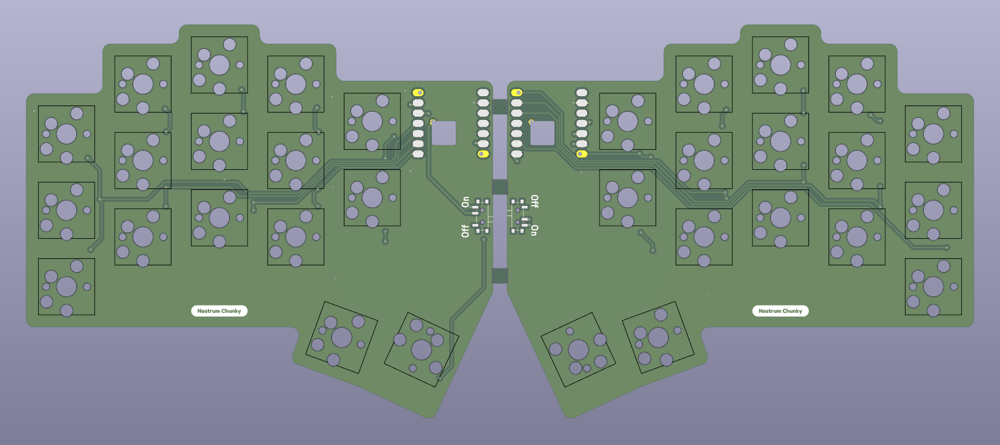
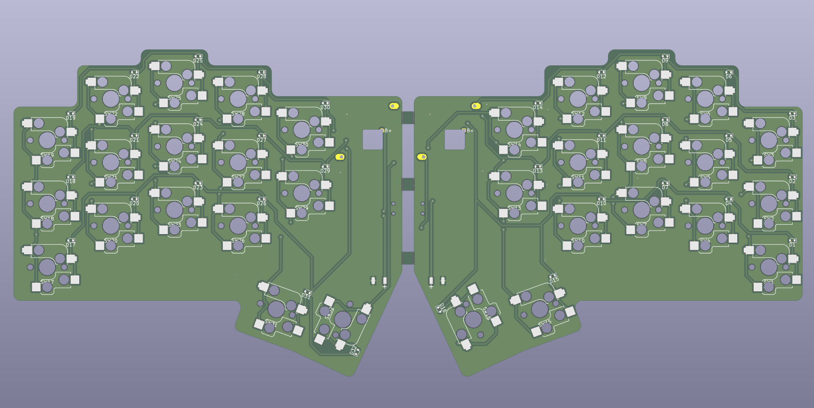
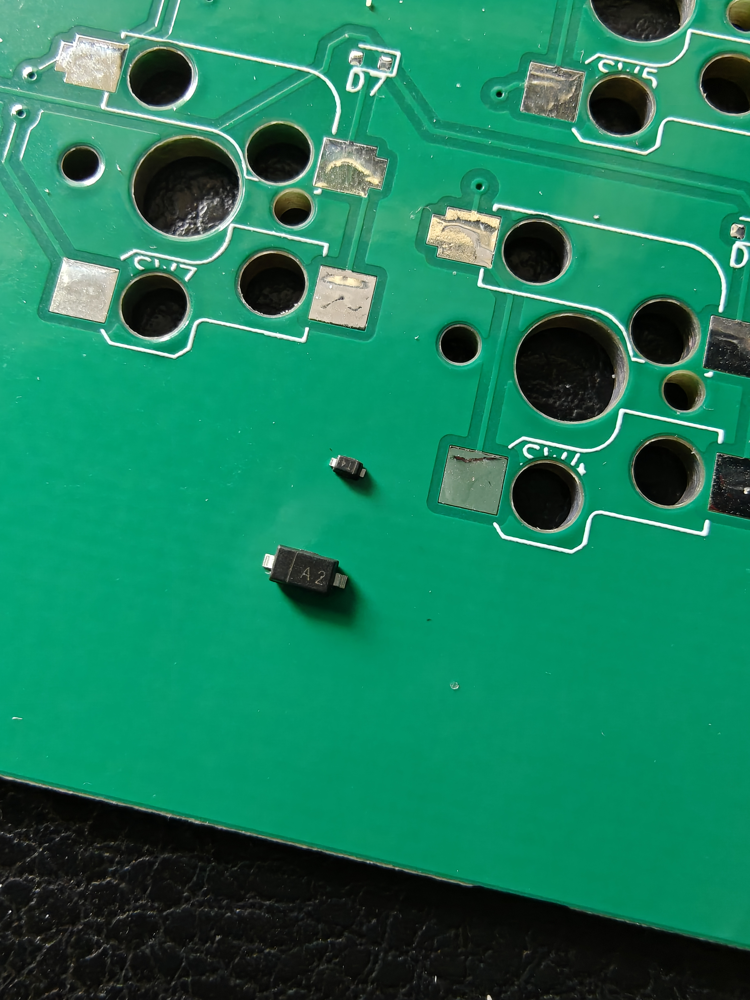

# Nostrum-Chunky
An MX Spaced 32 key Split KB using Seeed Xiao BLE.

- Created with the [ergogen](https://github.com/ergogen/ergogen) and KiCad9. Case files created with Autodesk Fusion360.
- Footprints for both MX and Choc V2 switches (Currently case only for MX)
- Firmware using ZMK, including the RGB Widget module from [Caksoylar](https://github.com/caksoylar/zmk-rgbled-widget)
- Inspiration from the [Hummingbird](https://github.com/PJE66/hummingbird) style [Berylline](https://github.com/jcmkk3/trochilidae#berylline) by [jcmkk3](https://github.com/jcmkk3)

## PCB View
| Front | Back |
| ----- | ----- |
|  |  |

## Design
Iniitially I just wanted to make a simple MX version of the NostrumX, but this ended up with a new case design with a gasket mounted 3dp plate. I also removed the splay that I decided was not required with the extra spacing from the MX layout.

I tried various foam and plate options and settled on just 0.5mm ixpe switch pads and silicone gaskets on the plate. I tried a thinner plate which created more flex, but I hated the bouncy feedback, so I went with a 3mm plate, printed with 100% infill. This seems to have created a really great sound and typing feel with the switches I chose - Akko Mirrors, which convieniently match the case.

Note - Akko switches are usually a little smaller than most, so for other switches, make sure to use the loose version of the plates (these use a 13.97 hole rather than the 13.9 for the Akko).

The case is joins together with 3x2 magnets for easy disassembly and access to the hidden power switch when required.

There should be enough space for the larger 402030 lipo in both sides, but I used what I had available, and the right half uses far less power anyway.

### Lesson Learned
Unlike previous builds that relied almost entirely on Ergogen to create the PCB, this time I left all the nets blank in Ergogen and used a schematic in Kicad. But I made a mistake and accidentally assigned SOD-523 diodes instead of SOD-123. These are significantly smaller, so if you want to copy or take inspiration, I would highly recommend not using them! If in the unlikely event you want to order the board for yourself, do yourself a favour and swap to SOD-123 and re-route. Unless you like soldering with a digital microscope. See pic for scale next to SOD-123.

## Parts
| Part  | Link |
| ------------- | ------------- |
| Battery 402030 | https://www.ebay.co.uk/itm/355875616696 |
| Battery 401322 | https://www.ebay.co.uk/itm/195234785175 |
| SMD diodes SOD-523 1N4148W T4 | https://www.mouser.co.uk/ProductDetail/637-1N4148WT |
| 1.5mm Fibreoptic cable (for led shinethrough) | https://www.aliexpress.com/item/1005005886250822.html |
| Power switch PCM12 | https://www.aliexpress.com/item/32912838968.html |
| Feet 3x14x1.5mm | https://www.aliexpress.com/item/1005006691343859.html |
| Seeeduino Xiao nrf52840 (various vendors) | https://thepihut.com/products/seeed-xiao-ble-nrf52840 | 
| Gaskets | https://www.aliexpress.com/item/1005008463912507.html|
| IXPE switch pads (Various vendors link just an example) | https://www.amazon.co.uk/dp/B0D6VR14WD |
| Magnets 3x2mm (I got mine on Amazon) | https://www.amazon.co.uk/Magnet-Expert%C2%AE-3mm-thick-Neodymium/dp/B003BKPIN0/ref=sr_1_22 |